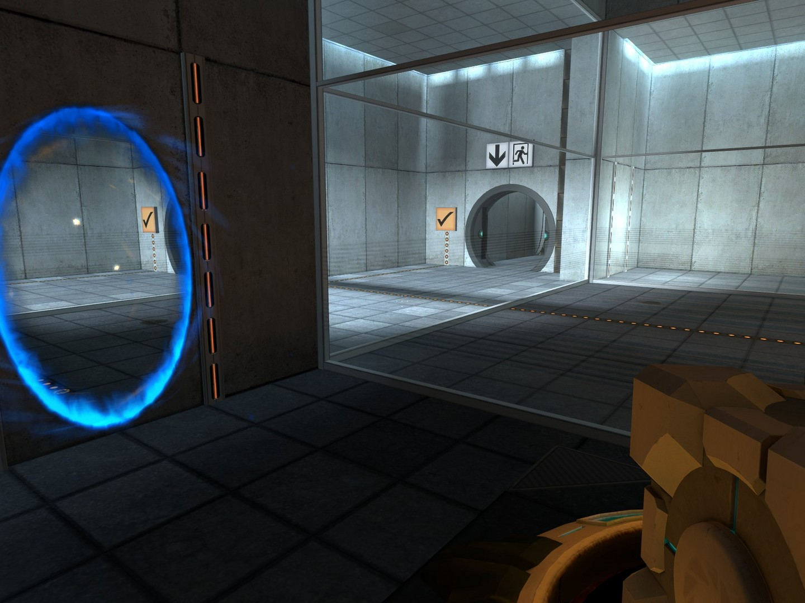
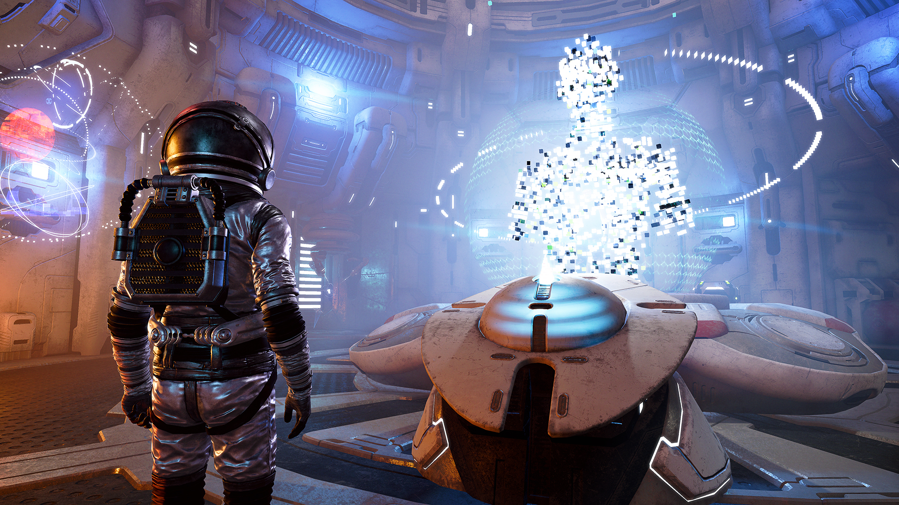
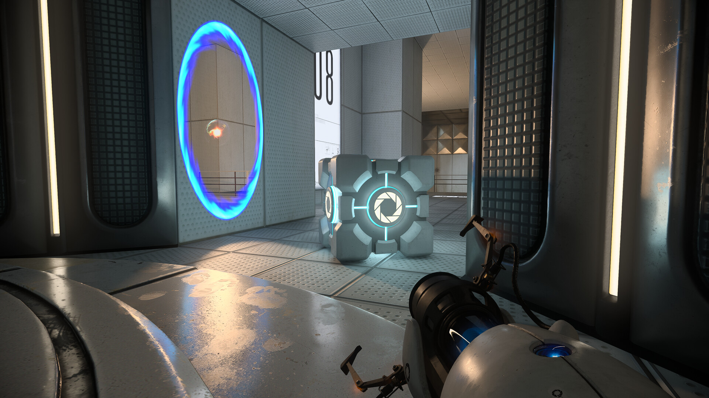
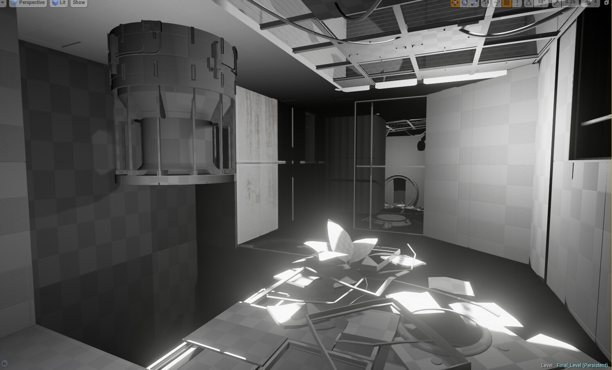

# Salle d'évasion spaciale

## Résumé

Ce projet sera un jeu de casse-tête oû il faut interagir avec l'environnement pour réussir des casse-têtes et avancer l'histoire.

Il est inspiré des jeux The Room car il prend inspiration des casse-têtes de ces jeux.
Le jeu commencera dans une salle remplie d'objets uniques et le joueur sera invité à interagir avec les éléments en les combinant, les détachant en deux pour les utiliser d'une autre façon, etc.
Par contre l'atmosphère du jeu sera tres différente des jeux The Room car ces jeux sont plutôt glauques mais celle de ce jeu sera au contraire plus relaxe.
Pour finir le jeu, il faut trouver des crystaux d'énergie et les placer dans une machine pour ouvrir une porte de sortie. Ces 3 crystaux sont cachés derrière les casse-têtes.

## Moodboard

</img>
</img>
</img>
</img>

## Carte de l'environnement

</img>

## Schéma de l'interaction
